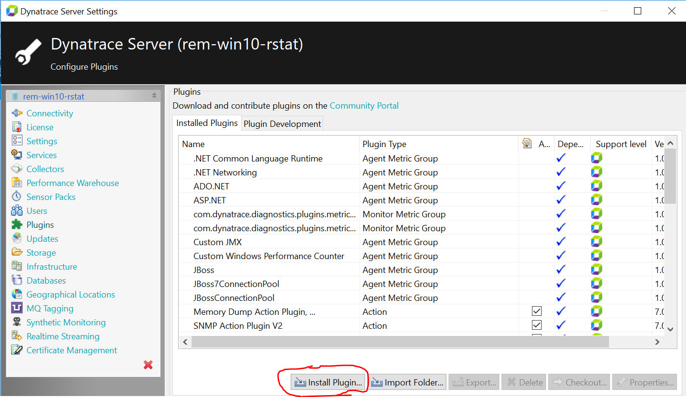

# xMatters Comm Plan for Dynatrace AppMon Integration
This xMatters Comm Plan receives and processes notifications from Dynatrace AppMon v7.0+, and features closed loop integration. 

Check out the video:

---------

<kbd>
  
</kbd>

---------

# Pre-Requisites
* Dynatrace AppMon v7.0+, configured with the xMatters AppMon Plugin - available [here](https://github.com/Dynatrace/Dynatrace-AppMon-xMatters-Plugin).
* xMatters account - If you don't have one, [get one](https://www.xmatters.com)!

# Files
* [DynatraceApplicationMonitoring30.zip](DynatraceApplicationMonitoring30.zip) - The comm plan (if needed) 
* [xMattersAppMonIntegration.mp4](media/xMattersAppMonIntegration.mp4) - short video of the integration in action

# How it works

You can configure any incident rule in Dynatrace AppMon to use the xMatters plugin. When such a rule fires, it will trigger an API call into the xMatters Inbound Integration specified by this Comm Plan. The integration script then parses out the payload and builds an event and passes that to xMatters. There is an outbound integration that uses the AppMon Incident ID to confirm the incident in AppMon.

# Installation
1. Ensure that the xMatters AppMon Plugin is deployed in AppMon and is configured against your incident rule(s) of choice. Ensure that the required plugin parameters are configured:

* xMatters Integration URL - this is provided in the xMatters Integration Builder after you import the Comm Plan
* Subject
* Message

Here's a screencap from the AppMon client Server Settings page that shows you how to install plugins:

<kbd>
  
</kbd>

2. Ensure that this Comm Plan has been deployed into xMatters. For help on configuring Comm Plans, please see this link:
https://help.xmatters.com/OnDemand/xmodwelcome/communicationplanbuilder/exportcommplan.htm

3. Update the `AppMon` outbound endpoint with the proper Base URL. If AppMon is running behind a firewall, check out the [xAgent here](https://help.xmatters.com/OnDemand/xmodwelcome/xmattersagent/xmatters-agent-topic.htm)

# Testing
Once you have the xMatters AppMon Plugin deployed in Dynatrace AppMon and the Comm Plan configured in xMatters, test things using the Plugin Development page in AppMon's Server Settings:

<kbd>
  
</kbd>

You should be able to see an event in the xMatters Reports page.

